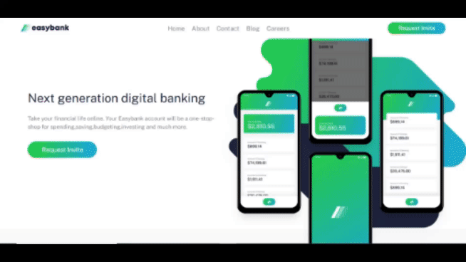

# Frontend Mentor - Easybank landing page solution

This is a solution to the [Easybank landing page challenge on Frontend Mentor](https://www.frontendmentor.io/challenges/easybank-landing-page-WaUhkoDN). Frontend Mentor challenges help you improve your coding skills by building realistic projects. 

## Overview

### The challenge

Users should be able to:

- View the optimal layout for the site depending on their device's screen size
- See hover states for all interactive elements on the page

### Screenshot

### Links

- Solution URL: [easybank-solution](https://github.com/lawrenceprieto/easybank?search=1)
- Live Site URL: [easybank](https://lawrenceprieto.github.io/easybank/)

### Built with

- Semantic HTML5 markup
- CSS custom properties
- Flexbox
- Media querry
- Mobile-first workflow
- [React](https://reactjs.org/)
- [Vite](https://vitejs.dev/)
- [React Bootsrap](https://react-bootstrap.github.io/)